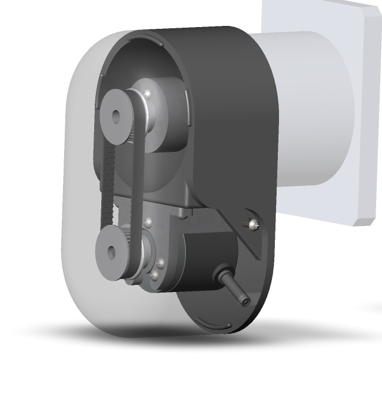

# Coil Counter - Electronic Coil Winding Counter


## 📋 Project Description

Electronic coil winding counter based on Raspberry Pi Pico microcontroller with 1.28" round TFT display. The device is designed for automatic turn counting when winding inductors, transformers, and other coil products.

## ✨ Key Features

- **Automatic turn counting** using optical incremental encoder
- **Manual mode** for counter adjustment
- **Target value mode** for setting desired turn count
- **Audio notification** when target is reached
- **Battery monitoring** with charge indication
- **Sleep mode** for power saving
- **Bright round display** 240x240 pixels
- **Professional enclosure** with external encoder module

## 🖼️ Project Images

| 3D Models | Device Views |
|-----------|--------------|
|  |  |
|  |  |
|  |  |

## 🛠 Hardware Platform

### Microcontroller
- **Raspberry Pi Pico** (RP2040)
- Clock frequency: 300 MHz
- Framework: Platformio

### Display
- **Waveshare RP2040 1.28" Round LCD**
- Resolution: 240x240 pixels
- Driver: GC9A01
- Interface: SPI (60 MHz)
- Backlight: PWM control
- **Double buffering with DMA** for smooth graphics

### DC-DC Converter
- **SX1308** step-up converter
- Input: 3.7V (li-ion battery)
- Output: 6.6V (encoder power)
- Enable control via GPIO

### Encoders
- **On-board EC11 encoder** (20 pulses/revolution) - for menu navigation
- **External optical incremental encoder** NPN type:
  - Resolution: 100 pulses/revolution
  - Voltage: 5-24V
  - Output: AB quadrature signals
  - Used for precise coil turn counting

### Components
- 2x Buttons (encoder + reset)
- Buzzer for audio signals
- Battery voltage measurement via ADC
- Power management system

## 🔌 Pin Configuration

| Function | GPIO Pin | Description |
|----------|----------|-------------|
| TFT_MOSI | 11 | SPI data line to display |
| TFT_SCLK | 10 | SPI clock line to display |
| TFT_CS    | 9 | Display Chip Select |
| TFT_DC | 8 | Display Data/Command |
| TFT_RST | 12 | Display Reset |
| TFT_BL | 25 | Display backlight (PWM) |
| COUNT_ENCODER_CLK | 21 | External encoder CLK (A channel) |
| COUNT_ENCODER_DT | 22 | External encoder DT (B channel) |
| ENCODER_CLK | 19 | On-board encoder CLK |
| ENCODER_DT | 18 | On-board encoder DT |
| ENCODER_BUTTON | 20 | Encoder button |
| RESET_BUTTON | 27 | Reset button |
| O_BUZZER | 17 | Buzzer output |
| POW_EN | 26 | DC-DC converter enable |
| I_BUS_5V | 16 | External power detection |
| BATTERY | 29 | Battery voltage measurement (ADC) |

## 📚 Used Libraries

### Graphics Libraries
- **[LVGL](https://lvgl.io/)** - modern graphics library for embedded systems
- **[TFT_eSPI](https://github.com/Bodmer/TFT_eSPI)** - high-performance TFT display library
- **Custom UI Library** - user interface generated with **SquareLine Studio**

### System Libraries
- **Arduino.h** - needs for TFT_eSPI
- **Pico SDK** - native RP2040 functions
- **Hardware Libraries**: ADC, PWM, GPIO, Time

## 🎨 User Interface

The graphical user interface is created using **SquareLine Studio** - a professional UI constructor for LVGL. This allows for:
- Visual UI design
- Automatic code generation
- Professional animations and transitions
- Optimized performance

## 🚀 Development Environment

- **PlatformIO** - main development environment
- **Platform**: Raspberry Pi (RP2040)
- **Framework**: Arduino
- **Toolchain**: ARM GCC
- **UI Designer**: SquareLine Studio

## ⚙️ Operation Modes

### 1. Work
- Encoders work
- Display shows

### 2. TARGET Mode (ENCODER_MODE_TARGET)
- Set target turn count using on-board encoder

### 3. MANUAL Mode (ENCODER_MODE_HAND)
- Manual counter adjustment using on-board encoder
- Useful for corrections

### 4. Sleep
- Backlight off
- DC\DC off

## 🔋 Power Management

- **Automatic sleep mode** after 180 seconds of inactivity
- **Display and DC-DC shutdown** in sleep mode
- **External power monitoring** (USB 5V detection)
- **Battery voltage measurement** with on-screen indication
- **SX1308 step-up converter** for efficient power usage

## 🎮 Controls

### Encoder Button
- **Short press**: Switch to TARGET mode
- **Long press** (500ms): Switch to MANUAL mode

### Reset Button
- **Short press**: Reserved for future functions
- **Long press**: Reset turn counter to zero

## 📊 Technical Specifications

- **External encoder resolution**: 100 pulses per revolution 
- **On-board encoder resolution**: 20 pulses per revolution
- **Display update rate**: ~50 FPS in idle
- **Button polling rate**: (5ms)
- **Activity check rate**: (50ms)
- **Battery update rate**: (1s)
- **Sleep timeout**: 180 seconds
- **Double buffering**: Enabled for smooth animations

## 🔧 Building the Project

### Requirements
- PlatformIO Core or PlatformIO IDE
- USB cable for programming

### Build Commands
```bash
# Build project
pio run

# Upload to microcontroller
pio run --target upload

# Clean project
pio run --target clean
```

### Display Configuration
Display settings are configured in `platformio.ini`:
- Driver: GC9A01_DRIVER
- Resolution: 240x240
- SPI frequency: 60 MHz
- DMA buffer: 16384 bytes
- Double buffering: Enabled

## 📁 Project Structure

```
├── src/                    # Source code
│   ├── main.cpp           # Main file with task scheduler
│   ├── control.cpp/h      # Button, power, and buzzer control
│   ├── encoders.cpp/h     # Encoder handling
│   └── display.cpp/h      # Display management
├── lib/                   # Libraries
│   ├── lvgl/             # LVGL graphics library
│   ├── TFT_eSPI/         # Display driver
│   └── ui/               # User interface (SquareLine Studio)
├── include/              # Header files
│   ├── lv_conf.h         # LVGL configuration
│   └── User_Setup.h      # TFT_eSPI configuration
├── img/                  # Project images
│   ├── 1-4.jpg          # 3D models
│   ├── 5.jpg            # Working device
│   └── 6-7.jpg          # PCB photos
└── platformio.ini        # Project configuration
```

## 🔧 Hardware Setup

### External Encoder Connection
Connect your optical incremental encoder (NPN, 5-24V):
- **A channel** → GPIO 21 (COUNT_ENCODER_CLK)
- **B channel** → GPIO 22 (COUNT_ENCODER_DT)
- **Power** → 6.6V (from SX1308 converter)
- **Ground** → GND

### Power Supply
- **Battery**: 3.7V Li-ion/Li-Po
- **USB**: 5V via USB-C (optional)\

## 📄 License

This project is licensed under the MIT License - see the [LICENSE](LICENSE) file for details.

### MIT License Benefits:
- ✅ Commercial use allowed
- ✅ Modification allowed
- ✅ Distribution allowed
- ✅ Private use allowed
- ✅ Only requires attribution

## 🤝 Contributing

Contributions are welcome! Please feel free to submit a Pull Request.

## 🙏 Acknowledgments

- **LVGL Team** for the excellent graphics library
- **Bodmer** for the TFT_eSPI library
- **SquareLine Studio** for professional UI design tools
- **Raspberry Pi Foundation** for the RP2040 microcontroller

---

**Firmware Version**: 1.0  
**Date**: June 2024  
**Platform**: Raspberry Pi Pico + Waveshare RP2040 1.28" LCD  
**Hardware**: SX1308 DC-DC + EC11 Encoder + Optical Incremental Encoder